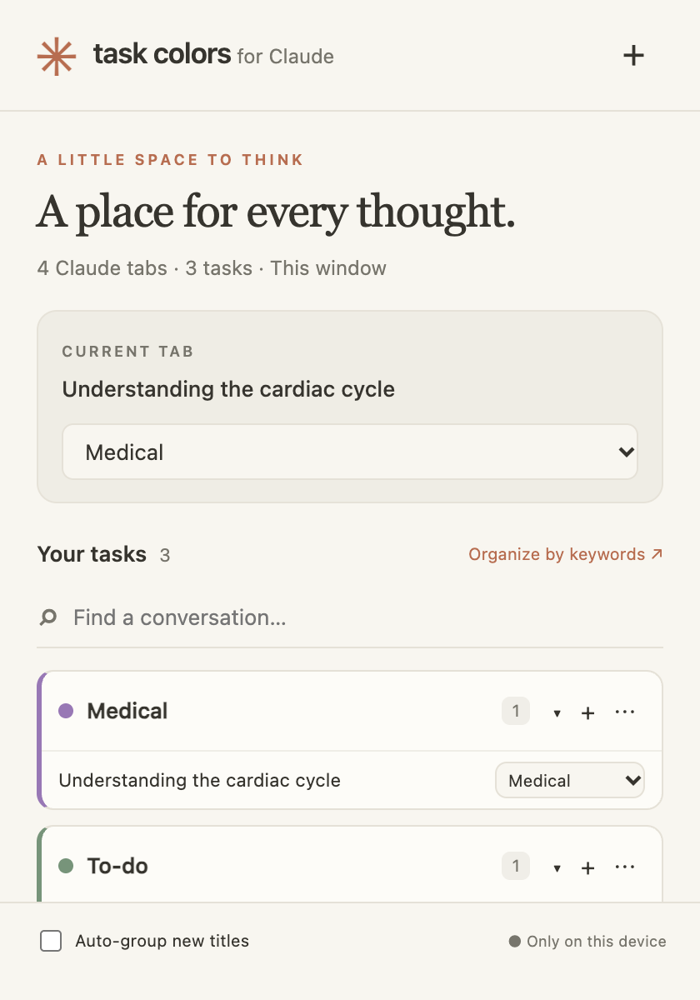

# Task Colors for Claude

A small, local-first Chrome extension that gives Claude conversations a place: personal task categories, memorable colors, and native browser tab groups.



## Install in Chrome

1. Download this repository with **Code → Download ZIP** and extract it, or clone it.
2. Open `chrome://extensions` in Chrome.
3. Enable **Developer mode** in the upper-right corner.
4. Click **Load unpacked** and select the folder containing `manifest.json`.
5. Pin **Task Colors for Claude** from Chrome’s extensions menu. Open a Claude conversation and click the extension.

No build, subscription, API key, or dependency installation is required. This is an unpacked extension, not a Chrome Web Store listing. Keep its folder in place. After pulling updates, use Reload on the extension card.

## Your workflow

- Start with **Medical** (purple), **To-do** (green), and **Math** (blue).
- Use **Current tab** to assign the active Claude conversation.
- Use **+** in the header to add categories, up to 24. Use **⋯** on a task to edit its name, exact color, native browser color, and title keywords.
- Use **+** on a task to open a new Claude chat inside that group.
- Click a conversation to switch to it, or use its dropdown to move it to another task or ungroup it.
- Use the arrow on a task to collapse or expand its native Chrome groups.
- Search conversation titles. The popup shows the current browser window; the same task can have a separate group in each window.
- **Organize by keywords** applies your rules to ungrouped, unpinned tabs in this window. Keywords are comma-separated, case-insensitive substrings of tab titles. If more than one task matches, the tab is left alone.
- **Auto-group new titles** is off by default. Enable it to apply the same rules when Claude tab titles change, across browser windows. It never reclassifies an already grouped tab. Existing tabs can be organized with the manual button.
- Deleting a task ungroups its conversations across windows; it never closes them.

### Custom colors and Chrome’s palette

Pick any six-digit hex color for the popup. Chrome's native tab-group API only supports grey, blue, red, yellow, green, pink, purple, cyan, and orange. Choose the native color you associate with each custom color. The extension cannot set arbitrary hex colors in Chrome’s tab strip.

### Persistence and scope

Task definitions and preferences are stored locally and survive browser restarts. Native Chrome groups own the tab membership. Groups are recognized by their exact `Task name · Claude` title, including Chrome-restored groups; this avoids relying on group IDs across restarts. Renaming a group directly in Chrome disconnects it from the task until you reassign its tabs. An existing all-Claude group with the same title is treated as that task. Groups containing unrelated websites are never reused or renamed by the worker.

Chrome controls session restoration: this extension does not reopen closed conversations or save chat histories. Pinned tabs must be unpinned before assignment. Other websites are never eligible for task assignment. Remove or change an auto-group keyword if you want a conversation to remain unassigned after future title updates.

## Design and implementation

A dependency-free Manifest V3 extension is a good fit for a focused tab utility: native tab groups provide familiar Chrome behavior, an event-driven service worker handles changes, and a plain HTML/CSS/JavaScript popup keeps startup quick and avoids a build pipeline. No Claude page scraping or content scripts are necessary.

The visual direction takes inspiration from Claude’s warm paper backgrounds, restrained typography, and terracotta accents, with an original four-color extension icon. The project is independent and is not affiliated with or endorsed by Anthropic.

Official references used:

- [Chrome tabGroups API and supported colors](https://developer.chrome.com/docs/extensions/reference/api/tabGroups)
- [Chrome tabs API, grouping, and host-scoped tab access](https://developer.chrome.com/docs/extensions/reference/api/tabs)
- [Manifest V3 service workers](https://developer.chrome.com/docs/extensions/develop/concepts/service-workers/basics)
- [Claude website](https://claude.ai)

## Permissions and privacy

- `storage`: local task names, colors, keywords, and auto-group preference.
- `tabGroups`: query, name, color, and collapse native groups.
- `https://claude.ai/*`: access titles and URLs for Claude tabs only. Broad browsing-history permission is not requested.

No analytics, telemetry, external fonts, remote scripts, backend, or chat-content collection. Tab titles are processed in memory for matching and display, not saved. The extension opens Claude pages only when requested. Chrome itself handles any account/session synchronization. See [PRIVACY.md](PRIVACY.md).

## Development and verification

```sh
npm test
npm run check
```

Requires Node.js 22+ for development tests; the extension itself runs in Chrome 102+. Thirteen automated tests exercise matching, validation, domain restrictions, grouping, window isolation, concurrent actions, deletion, mixed groups, new chats, and opt-in automation using a Chrome API test double. CI runs these tests and syntax checks.

The optional UI smoke test requires a locally available `playwright` package and Google Chrome:

```sh
node tests/ui-smoke.cjs
```

Set `NODE_PATH` to an existing dependency directory if Playwright is not installed locally. Set `CHROME_PATH` to override the Chrome executable. This test renders synthetic conversations, adds a task, searches, opens the editor, checks overflow and script errors, and writes screenshots to `docs/`. It does not inspect your real browser tabs.

Automated behavior tests and browser UI smoke checks passed during implementation. A real extension installation and full browser-restart test remain manual checks:

1. Load unpacked and assign two Claude tabs to Medical; confirm one purple native group.
2. Create a task with a custom hex color; confirm the popup color and selected native color.
3. Create a chat in that task, move it, collapse/expand the group, and switch conversations.
4. Open a second window; verify separate groups and that edits update both windows.
5. Enable auto grouping and change a Claude title to match a keyword. Test ambiguous titles and pinned tabs.
6. Restart Chrome with session restoration enabled; verify restored groups are recognized.
7. Delete a task and verify its conversations remain open.
