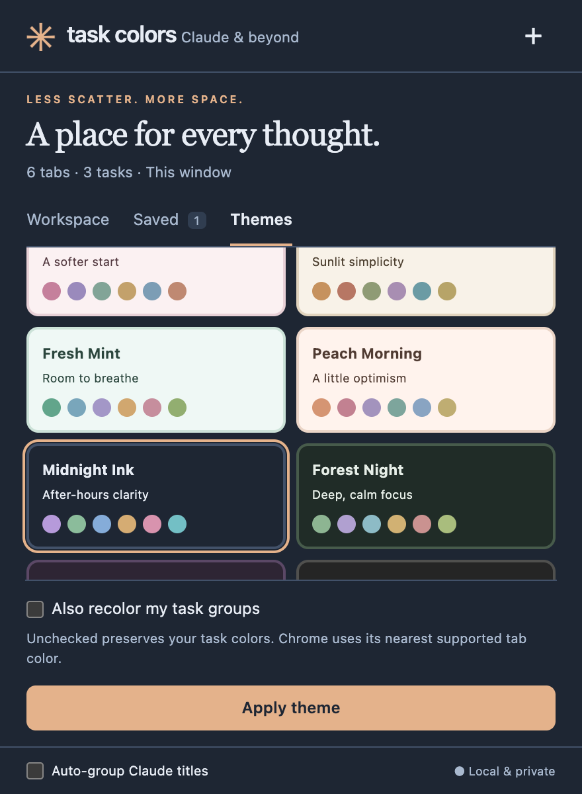

# Task Colors for Claude

Give every task a home: Claude chats, other AI tools, research pages, and useful links in a personal color-coded workspace. A compact, Claude-inspired popup with saved collections, reversible focus mode, and 12 themes.


## Install or update

1. Download this repository using **Code → Download ZIP** and extract it, or clone it.
2. Open `chrome://extensions`, enable **Developer mode**, and choose **Load unpacked**.
3. Select the folder containing `manifest.json`. Pin **Task Colors for Claude**.
4. Open a regular website and click the extension. The default shortcut is **Alt+Shift+C** (Option+Shift+C on Mac); customize it at `chrome://extensions/shortcuts`.

No build, account, subscription, or API key is required. Chrome 102+ is supported. Keep the extension folder in place. To update an existing installation, replace its files or pull the repository, then click **Reload** on its extension card.

**Version 1.1 adds the `tabs` permission** to display titles and URLs for research pages and other AI tools. Chrome may ask you to accept the updated permission or re-enable the extension. Existing task definitions, custom colors, and native groups are preserved. The extension does not read page bodies or chat messages.

## A simple workspace

- **Current tab:** assign a website or AI conversation to a task. Medical, To-do, and Math are ready to use.
- **Task name:** click to reveal its tabs and tools. **⋯** edits the name, custom color, native browser color, and Claude title keywords. Create up to 24 tasks using the header’s **+**.
- **Mixed groups:** put Claude, ChatGPT, Gemini, reference articles, documents, or any HTTP/HTTPS page together. Pinned tabs must first be unpinned. Chrome pages, local files, and other special URLs are excluded.
- **+ Link / + Chat:** open a research URL or a new Claude conversation inside the task, in the background.
- **Find and move:** search titles or URLs (including domains), filter to Claude or ungrouped tabs, select checkboxes, and move up to 200 tabs together. Press **/** to focus search. Single-tab dropdowns can move or ungroup individual tabs.
- **Collapse:** the triangle on a task collapses or expands its native Chrome group. Clicking the task name controls the popup list separately.
- **Focus:** activate a task and collapse the other native groups in this window. **Exit focus** restores the original collapsed/expanded states, including after switching between focused tasks. Ungrouped tabs remain visible. Nothing is closed or suspended. Focus state is session-only; after a browser restart, use Chrome’s normal expand/collapse controls.
- **Save:** take a snapshot of the task’s links in this window. Saving never closes tabs. On the **Saved** shelf, preview links, restore them, or remove the saved copy. Restore skips exact URLs already in the destination task. It does not move matching tabs out of unrelated tasks or windows; those links may open as a separate copy. A deleted task is recreated when its collection is restored. Up to 50 collections, each with up to 200 unique URLs.

Saved collections store URLs and titles, not page contents, form entries, chat drafts, scroll positions, or authenticated sessions. They persist locally across browser restarts but are removed when the extension is uninstalled. Removing a collection or deleting a task never closes tabs.

## Twelve ready-made themes

| Light | Dark |
| --- | --- |
| Claude Paper | Midnight Ink |
| Sage Garden | Forest Night |
| Ocean Air | Velvet Plum |
| Lavender Study | Graphite |
| Rose Quartz | |
| Desert Sand | |
| Fresh Mint | |
| Peach Morning | |

Choose **Themes**, click a card to preview, then **Apply theme**. Changing the popup theme preserves your task colors by default, maintaining the associations you have learned. To recolor existing tasks as well, check **Also recolor my task groups**. Each theme includes a six-color task palette; it repeats for larger task sets. The task editor includes clickable palette swatches and a custom hex picker for individual overrides.

Chrome’s native tab strip supports nine named colors, not arbitrary hex values. Exact custom colors appear in the popup; applying a theme palette chooses the nearest native browser color. You can override that pairing in each task’s editor. Themes change the extension UI and optionally task-group colors; they do not recolor website contents or the entire Chrome window.



## Optional Claude automation

**Auto-sort Claude** applies comma-separated title keywords to ungrouped, unpinned Claude tabs in this window. Matching is case-insensitive substring matching; ambiguous matches stay unassigned. **Auto-group Claude titles** is off by default and runs when Claude titles change, across browser windows.

Automation stays Claude-only even though manual groups now support any website. This preserves existing rules without silently reorganizing unrelated research pages. Already grouped tabs are never automatically reassigned.

## Research behind the features

Reviewed the products’ own current documentation on October 2, 2026. These are the strongest fits for this focused extension, rather than a claim that one product is universally best.

| Source | Useful feature | Adaptation here |
| --- | --- | --- |
| [Toby collections](https://help.gettoby.com/support/solutions/articles/66000526357-collections) | Related project and research links in reusable collections | Mixed website task groups and a saved collection shelf |
| [Workona tab manager](https://workona.com/help/tab-manager/) | Project spaces, focus, multiselect, and moving tabs | Reversible collapse-based focus, bulk moves, and task-level controls |
| [OneTab](https://www.one-tab.com/) | A persistent list of tabs to reopen later | Explicit, local snapshots and restore with duplicate avoidance within the destination task |
| [Workona shortcuts](https://workona.com/help/shortcuts/) | Fast access without navigating browser menus | Popup keyboard shortcut and **/** search |

No automatic tab closing, background suspension, new-tab replacement, or cloud account is needed for these features. This extension does not implement OneTab’s memory-saving tab closure or Workona’s full workspace/session model.

## Architecture and persistence

Dependency-free Manifest V3, an event-driven service worker, native Chrome tab groups, and plain HTML/CSS/JavaScript. Worker mutations are serialized to prevent duplicate group creation or lost settings. No content scripts, backend, external fonts, remote code, or page scraping.

Task definitions, theme preference, and explicitly saved collections use local storage. Focus snapshots use session storage, so ephemeral group IDs are not reused across browser restarts. Native groups are recognized by their exact `Task name · Claude` title, retained for compatibility with version 1.0. A group with that exact title is treated as the task, including mixed website groups. Renaming it directly in Chrome disconnects it until tabs are reassigned. Chrome controls which live tabs and groups are restored after restart; saved collections are separate snapshots.

References: [Chrome tabs and permissions](https://developer.chrome.com/docs/extensions/reference/api/tabs), [tabGroups and supported colors](https://developer.chrome.com/docs/extensions/reference/api/tabGroups), [Manifest V3 service workers](https://developer.chrome.com/docs/extensions/develop/concepts/service-workers/basics).

The visual direction takes inspiration from [Claude](https://claude.ai)’s warm backgrounds, serif headings, and restrained accents. This project is independent and is not affiliated with or endorsed by Anthropic, Toby, Workona, or OneTab.

## Privacy

- `tabs`: query tab titles and URLs to display and organize websites. Chrome may describe this permission as access to browsing history; the extension does not request the `history` API or query past browsing history.
- `tabGroups`: query, name, color, and collapse native groups.
- `storage`: local configuration and saved collections; session-only focus state.

No telemetry, analytics, server uploads, or page/chat content access. URLs and titles are saved only when you explicitly save a collection. Opening or restoring a link navigates Chrome to that website normally. [Full privacy details](PRIVACY.md).

## Development and verification

```sh
npm test
npm run check
```

Node.js 22+ is required for tests, not for installing the extension. The 25 behavior tests cover mixed groups, v1 migration, protocol restrictions, matching, concurrent changes, multi-window behavior, bulk operations, focus restoration, themes, and collection storage/restore. CI runs them on every push and pull request.

Optional browser integration test, with Playwright and Google Chrome available:

```sh
node tests/ui-smoke.cjs
```

Set `NODE_PATH` to an existing Playwright package directory if needed, or `CHROME_PATH` to a Chrome executable. The test runs the real popup and worker against synthetic Chrome APIs and tabs. It checks domain search, mixed groups, selection and bulk moves, adding URLs, reversible focus, saved collections, theme persistence, opt-in recoloring, custom colors, and all 12 theme layouts. Screenshots are written to `docs/`; no personal browser tabs are accessed. Mocked tests do not substitute for installing the extension in Chrome.

Manual installation checks:

1. Reload a v1 installation, accept the updated tab permission if prompted, and confirm prior colors and groups remain.
2. Group a Claude conversation, another AI tool, and a reference page. Move selections and add a URL.
3. Focus a task, switch focus, then exit; verify prior native group states return.
4. Save a task, close one of its tabs manually, and restore; verify only the missing link in that task reopens.
5. Preview light/dark themes, apply with and without recoloring, and reopen the popup.
6. Restart Chrome with session restore enabled; verify task groups and saved collections persist as described.
